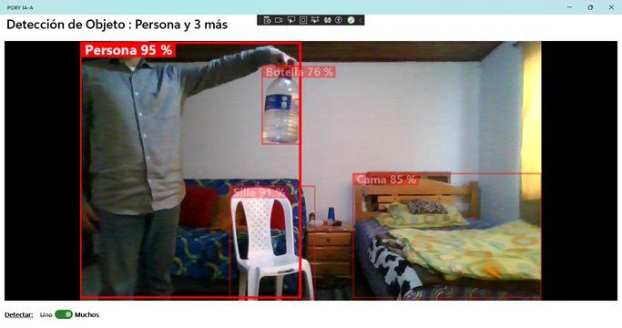
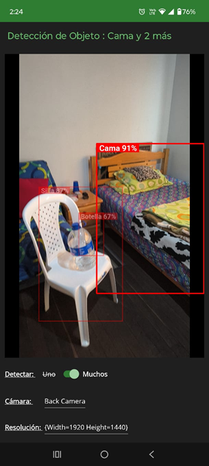

# PORY IA-A 👁️🟢

**PORY IA-A** es una aplicación multiplataforma (Windows, Android) desarrollada con **.NET MAUI** que implementa inteligencia artificial en tiempo real para la detección y clasificación de objetos.

## 🚀 Sobre el Proyecto
Este proyecto nació como un reto técnico para integrar el potente motor de visión **YOLO11**, logrando una interfaz fluida con un diseño moderno en color verde esmeralda.

## 📱 Vista Previa

  
  

## ✨ Características principales
* **Detección en tiempo real:** Uso de la cámara para identificar objetos instantáneamente (cada segundo).
* **Motor ONNX:** Inferencia local optimizada mediante `Microsoft.ML.OnnxRuntime`.
* **Interfaz MAUI:** Diseño intuitivo y minimalista.
* **Community Toolkit:** Utilizando el control CameraView para la visualización de lo capturado por la cámara en tienpo real. También para capturar la imagen a ser procesada.
* **Gráficos Dinámicos:** Dibujo de cajas delimitadoras (Bounding Boxes) mediante SkiaSharp.

## 🛠️ Tecnologías utilizadas
* **Lenguaje:** C#
* **Framework:** .NET MAUI (.NET 10)
* **IA/ML:** Ultralytics YOLO11 (Archivo en formato .onnx)
* **Librerías clave:**
    * `CommunityToolkit.Maui.CameraView`
    * `SkiaSharp`
    * `Microsoft.ML.OnnxRuntime`

## ⚖️ Licencia y Atribuciones
Este proyecto se distribuye bajo la licencia **GNU AGPLv3** (debido a la dependencia de YOLO11). 
Para más detalles sobre las licencias de terceros (como el icono de **Iconoir** y las librerías de **Microsoft**), consulta el archivo:
👉 `THIRD-PARTY-NOTICES.md`

## 🤖 Créditos
Desarrollado con el apoyo de **Google Gemini** como asistente de arquitectura y depuración de código.
